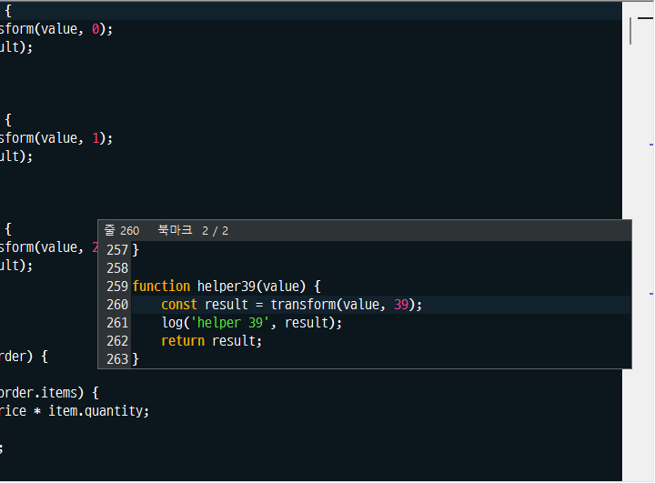

# ScrollMarks

문서 전체에서 무엇이 어디에 있는지를 세로 스크롤바 오른쪽의 좁은 막대에
보여 주는 Notepad++ 플러그인입니다. 선택한 텍스트와 같은 위치, 북마크,
변경된 줄, 찾기 표시, 스타일 토큰, 커서 위치를 표시합니다. 마커를 클릭하면
그 위치를 보여 주고, 마우스를 올리면 주변 줄을 미리 봅니다.

[English](README.md)



## 기능

- **같은 단어 마커.** 단어를 선택하면 문서 전체의 같은 단어마다 마커가
  찍힙니다. 지금 선택한 위치는 다른 색으로 막대 폭 전체에 그려집니다.
- **다른 표시.** 변경 내역(수정됨, 저장됨, 원래대로, 수정본으로 되돌림),
  북마크, *찾기 > 표시* 결과, *토큰의 모든 항목 스타일 지정* 의 스타일 토큰
  5종, 그리고 직접 지정한 Scintilla 인디케이터 번호를 표시합니다.
- **커서 위치선.** 커서가 있는 줄 위치에 가는 선을 그립니다.
- **스크롤바와 정확히 맞는 위치.** 마커는 그 줄이 화면 맨 위에 올 때의
  thumb 윗변 위치에 그려집니다. 그래서 화면에 보이는 줄의 마커는 항상
  thumb 안에 있습니다. 확대/축소, 접힌 코드, *마지막 줄 너머로 스크롤*
  설정, Windows 가 thumb 를 최소 크기로 키우는 긴 문서에서도 같습니다.
- **칸과 우선순위.** 마커 종류마다 위치(왼쪽, 가운데, 오른쪽)와 폭이
  있습니다. 우선순위가 높을수록 위에 그려지고 기본 폭이 좁아서, 겹쳐도 서로
  둘레가 보입니다.
- **클릭하면 그 위치를 보여 줌.** 마커를 클릭하면 그 줄을 화면 가운데로
  가져오고 잠깐 강조합니다. *마커를 클릭하면 커서도 그 위치로 이동* 을
  켜지 않으면 커서와 선택은 그대로 둡니다.
- **이전·다음 위치로 이동.** 두 명령이 커서와 선택을 선택한 텍스트, 또는
  커서 위치 단어의 이전·다음 위치로 옮깁니다. 문서 끝에 닿으면 반대쪽
  끝에서 이어갑니다. 단축키는 *설정 > 단축키 관리자 > 플러그인 명령* 에서
  지정합니다.
- **마우스오버 미리보기.** 마커에 마우스를 올리면 그 줄과 위아래 3줄을
  에디터와 같은 글꼴, 구문 색, 하이라이트로 보여 주고, 줄 번호, 마커 종류,
  *n / m* 을 표시합니다. 그 줄들에 있는 같은 단어도 모두 강조합니다. Notepad++ 가
  강조하지 않는 화면 밖 줄이어도 마찬가지입니다.
- **Notepad++ 설정을 따름.** 대소문자 구분, 단어 단위, 스마트 강조
  켜기/끄기, 대용량 파일 제한, 테마 색, 다크 모드, 언어, 마우스오버 지연을
  바꾸지 않으면 Notepad++ 와 Windows 설정을 그대로 씁니다.
- **영어와 한국어.** 언어는 Notepad++ 를 따르거나 직접 고를 수 있습니다.

## 마커 우선순위

위에 그려지는 것부터입니다. 모든 값은 설정에서 바꿀 수 있습니다.

| 우선순위 | 마커 | 위치 | 폭 | 자동 색 |
|---|---|---|---|---|
| 1 | 커서 위치선 | 가운데 | 100%, 높이 2px | 검정에 가까운 색 또는 흰색에 가까운 색 |
| 2 | 선택한 위치 | 가운데 | 100% | 파랑 |
| 3 | 같은 단어 | 가운데 | 28% | 테마의 스마트 강조 색 |
| 4 | 찾기 표시 결과 | 가운데 | 42% | 테마의 *표시* 색 |
| 5 | 스타일 토큰 1~5 | 가운데 | 56% | 테마의 토큰 색 5개 |
| 6 | 기타 인디케이터 (기본 끔) | 가운데 | 56% | 각 인디케이터의 색 |
| 7 | 북마크 | 오른쪽 | 22% | 보라 |
| 8 | 변경 내역 | 왼쪽 | 22% | 호박색, 청록, 회색, 주황 |

테마 색이 막대 배경에서 잘 보이지 않으면 자동으로 더 진하게 또는 더 밝게
보정합니다. 고정 색은 밝은 배경용과 어두운 배경용이 따로 있어 막대 배경에
맞춰 고릅니다. 커서가 선택한 위치에 있으면 커서 위치선은 그리지 않고 선택한
위치만 그립니다.

## 가벼움

ScrollMarks 는 Notepad++ 와 Scintilla API 만 쓰는 C++ 플러그인입니다.
스크립트 엔진, .NET, 별도 런타임을 쓰지 않습니다.

- 검색과 표시 수집은 몇 밀리초 단위로 나눠 실행되어 입력과 스크롤을
  기다리게 하지 않습니다. 테스트에서 2,100만 바이트, 40만 줄 파일의 모든
  줄이 일치하는 경우에도 Notepad++ 는 항상 23ms 안에 응답했습니다.
- 스크롤할 때는 검색도 그리기도 하지 않습니다.
- 편집하면 입력이 250ms 멈춘 뒤에만 다시 살펴봅니다.
- 북마크, 찾기 표시, 스타일 토큰은 표시에서 다음 표시로 건너뛰며 읽으므로
  비용이 파일 크기가 아니라 표시 개수에 비례합니다.
- 북마크 변경 알림은 북마크를 표시할 때만 Notepad++ 에 요청합니다.
- 작업 후 Notepad++ 의 검색 대상과 플래그를 매번 원래대로 되돌려 다른
  기능과 플러그인에 영향을 주지 않습니다.

## 설치

### Plugin Admin

목록에 등록된 뒤에는 **플러그인 > 플러그인 관리자** 에서 *ScrollMarks* 를
찾아 체크하고 **설치** 를 누릅니다.

### 수동 설치

1. [릴리스](https://github.com/Hong-Seungmin/ScrollMarks/releases) 에서
   Notepad++ 에 맞는 zip 을 받습니다. 64비트는 `x64`, 32비트는 `x86`,
   ARM 은 `arm64` 입니다. **?** > **Notepad++ 정보** 에서 확인할 수 있습니다.
2. Notepad++ 를 종료합니다.
3. zip 을 Notepad++ 폴더의 `plugins\ScrollMarks\` 에 풀어
   `plugins\ScrollMarks\ScrollMarks.dll` 이 되게 합니다.
4. Notepad++ 를 실행합니다.

Notepad++ 8.3 이상이 필요합니다. Windows 11 의 Notepad++ 8.9.3 에서
테스트했습니다. 변경 내역 표시는 *변경 내역* 기능이 있는 Notepad++ 에서 그 기능이
켜져 있을 때 동작합니다.

## 사용법

- 단어를 선택하거나 더블클릭하면 바로 마커가 나타납니다.
- **플러그인 > ScrollMarks > 마커 표시** 로 막대를 켜고 끕니다.
- **플러그인 > ScrollMarks > 다음 위치로 이동 / 이전 위치로 이동** 이 커서를
  옮깁니다. 기본 단축키는 없습니다.
- **플러그인 > ScrollMarks > 설정...** 에서 설정을 바꿉니다.

## 설정

탭은 *일반*, *같은 단어*, *다른 표시*, *커서 위치선*, *클릭과 이동* 입니다.
마우스오버 미리보기 설정과 막대 견본은 탭 아래에 있어서 어느 탭에서도 보이고,
견본은 값을 바꿀 때마다 바로 결과를 보여 줍니다.

설정은 `plugins\Config\ScrollMarks.ini` 에 저장됩니다. *auto* 는 Notepad++,
테마, Windows 의 값을 따른다는 뜻입니다.

| 설정 | 기본값 |
|---|---|
| 마커 표시 | 켬 |
| 언어 | auto (Notepad++ 언어) |
| 막대 폭 | auto (스크롤바 폭) |
| 마커 최소 높이 | 2px |
| 배경 색 | auto (Notepad++ 다크 모드 배경, 또는 Windows 버튼 면 색) |
| 선택한 텍스트와 같은 위치 모두 표시 | 켬 |
| Notepad++ 스마트 강조가 켜져 있을 때만 | 켬 |
| 대소문자 구분, 단어 단위로만 | auto (스마트 강조 옵션, *찾기 대화 상자 설정 사용* 이 켜져 있으면 찾기 창) |
| 최소 길이 | 1글자 |
| 최대 마커 수 | 100,000 (0 이면 제한 없음) |
| 선택이 없으면 커서 위치의 단어 표시 | 끔 |
| Notepad++ 가 제한하는 대용량 파일도 표시 | 끔 |
| 마커 종류별 색, 위치, 폭 | *마커 우선순위* 참고 |
| 기타 인디케이터 번호 | 비어 있음 |
| 커서 위치선 두께 | 2px |
| 마커를 클릭하면 커서도 그 위치로 이동 | 끔 |
| 클릭한 줄을 화면 가운데로 | 켬 |
| 클릭으로 이동한 줄을 잠깐 강조 | 켬, 600ms, 자동 색 |
| 빈 곳을 클릭하면 그 지점으로 스크롤 | 켬 |
| 이전·다음: 반대쪽 끝에서 이어서 이동 | 켬 |
| 이전·다음: 이동한 줄을 화면 가운데로 | 켬 |
| 마커에 마우스를 올리면 미리보기 표시 | 켬 |
| 주변 줄 수 | 위아래 각각 3줄 |
| 표시 지연 | auto (Windows 마우스 호버 시간) |
| 미리보기 폭 | 에디터 폭의 60% |

픽셀 값은 100% 배율 기준이며 디스플레이 배율에 맞춰 커집니다.

Notepad++ 는 종료할 때 환경 설정을 저장합니다. 그래서 Notepad++ 환경
설정에서 바꾼 값은 Notepad++ 를 다시 시작한 뒤 ScrollMarks 에 반영됩니다.

## 참고

- 막대는 텍스트 영역 오른쪽에서 스크롤바 폭만큼을 씁니다. 같은 자리에 막대를
  그리는 다른 플러그인이 있으면 나란히 보입니다. 하나만 원하면 한쪽을 끄세요.
- 자동 줄바꿈 상태에서 줄바꿈된 줄의 마커는 그 줄의 첫 행 위치에
  그려집니다.
- 다중 선택과 사각형 선택은 표시하지 않습니다.

## 빌드

C++ 워크로드(v143 툴셋)가 포함된 Visual Studio 2022 또는 Build Tools 와
Windows 10/11 SDK 가 필요합니다.

```
msbuild ScrollMarks.vcxproj -p:Configuration=Release -p:Platform=x64
msbuild ScrollMarks.vcxproj -p:Configuration=Release -p:Platform=Win32
msbuild ScrollMarks.vcxproj -p:Configuration=Release -p:Platform=ARM64
pwsh scripts/package.ps1
```

DLL 은 `bin\<platform>\Release\`, Plugin Admin 용 zip 은 `dist\` 에
만들어집니다.

`v1.1.0` 같은 태그를 push 하면 GitHub Actions 가 세 아키텍처를 빌드하고
zip 과 SHA-256 해시가 담긴 draft 릴리스를 만듭니다. 태그는
`src/Version.h` 의 버전과 같아야 합니다.

## 라이선스

GNU General Public License v3.0 이상. [LICENSE](LICENSE) 를 참고하세요.

`npp/` 의 파일은 [Notepad++](https://github.com/notepad-plus-plus/notepad-plus-plus)
와 [Scintilla](https://www.scintilla.org/) 프로젝트의 것으로 각자의
라이선스를 따릅니다.
