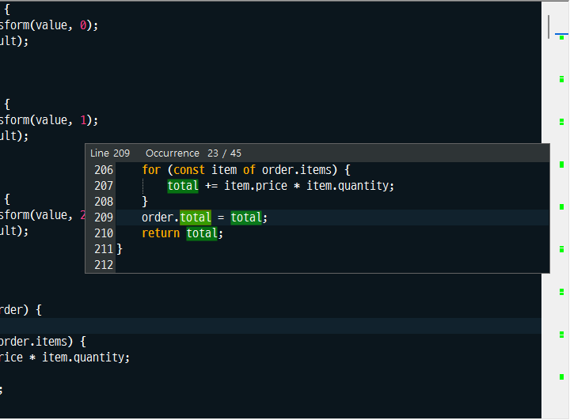
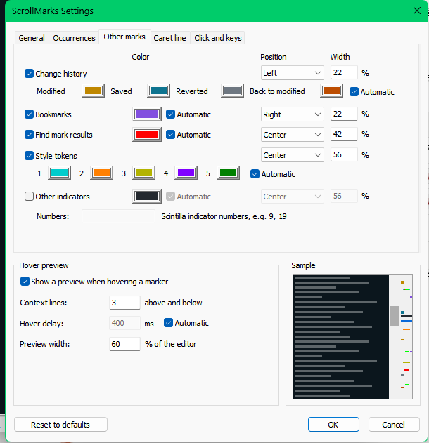

# ScrollMarks

A Notepad++ plugin that shows where things are in the whole document, in a
thin bar on the right of the vertical scrollbar: every occurrence of the
selected text, bookmarks, changed lines, find marks, style tokens and the
caret. Click a marker to look there, hover it to preview the lines around it.

[한국어](README.ko.md)



## Features

- **Occurrence markers.** Select a word and every occurrence in the whole
  document gets a marker. The occurrence you selected has its own color and
  the full width of the bar.
- **Other marks.** Change history (modified, saved, reverted, back to
  modified), bookmarks, results of *Search > Mark*, the five style tokens of
  *Style All Occurrences of Token*, and any other Scintilla indicator numbers
  you list.
- **Caret line.** A thin line where the caret is.
- **Markers line up with the scrollbar.** A marker sits where the top of the
  scrollbar thumb is when its line is at the top of the screen. The marker of
  every line on screen is therefore always inside the thumb, at any zoom
  level, with folded code, with *Enable scrolling beyond last line*, and in
  long documents where Windows enlarges the thumb to its minimum size.
- **Lanes and priorities.** Each kind of marker has a position (left, center,
  right) and a width. Higher priorities are drawn on top and narrower by
  default, so overlapping markers stay visible around each other.
- **Click to look there.** Clicking a marker scrolls its line to the middle of
  the screen and briefly highlights it. The caret and the selection stay where
  they are, unless you turn on *Clicking a marker also moves the caret there*.
- **Previous and next occurrence.** Two commands move the caret and the
  selection to the previous or next occurrence of the selected text, or of
  the word at the caret, continuing from the other end of the document.
  Assign keys to them in *Settings > Shortcut Mapper > Plugin commands*.
- **Hover to preview.** Hovering a marker shows the line and three lines
  above and below, with the editor's own fonts, syntax colors and highlights,
  plus the line number, the kind of marker and *n / m*. Every occurrence of
  the selected text in those lines is highlighted, even off screen where
  Notepad++ does not highlight it.
- **Follows Notepad++.** Match case, whole word, smart highlighting on/off,
  the large file restriction, theme colors, dark mode, the language and the
  hover delay come from Notepad++ and Windows unless you change them.
- **English and Korean.** The language follows Notepad++ or can be chosen.

## Marker priorities

From the top. Every value can be changed in the settings.

| Priority | Marker | Position | Width | Automatic color |
|---|---|---|---|---|
| 1 | Caret line | center | 100 %, 2 px high | near black or near white |
| 2 | Selected occurrence | center | 100 % | blue |
| 3 | Occurrences | center | 28 % | the smart highlighting color of the theme |
| 4 | Find mark results | center | 42 % | the *Mark* color of the theme |
| 5 | Style tokens 1 to 5 | center | 56 % | the five token colors of the theme |
| 6 | Other indicators (off) | center | 56 % | the color of each indicator |
| 7 | Bookmarks | right | 22 % | violet |
| 8 | Change history | left | 22 % | amber, teal, gray, orange |

Theme colors are made darker or lighter when they would be hard to see on the
bar. The fixed colors have a light and a dark variant, chosen by the bar
background. When the caret is on the selected occurrence, only the occurrence
is drawn.

## Lightweight by design

ScrollMarks is written in C++ against the Notepad++ and Scintilla APIs. It
does not use a script engine, .NET or any extra runtime.

- Searching and collecting marks run in slices of a few milliseconds, so
  typing and scrolling never wait. With every line of a 21 MB, 400,000 line
  file matching, Notepad++ answered within 23 ms at all times in testing.
- Nothing is searched or drawn while you scroll. Scrolling only moves the
  scrollbar thumb, the markers stay where they are.
- Edits are looked at again only after a 250 ms pause in typing.
- Bookmarks, find marks and style tokens are read by jumping from one mark to
  the next, so the cost depends on the number of marks, not on the file size.
- Notepad++ is asked for bookmark change notifications only while bookmarks
  are shown.
- The search target and flags of Notepad++ are restored after every slice, so
  other features and plugins are not affected.

## Installation

### Plugin Admin

Once ScrollMarks is listed: **Plugins > Plugins Admin**, search for
*ScrollMarks*, tick it and press **Install**.

### Manual

1. Download the zip for your Notepad++ from the
   [releases](https://github.com/Hong-Seungmin/ScrollMarks/releases):
   `x64` for 64-bit, `x86` for 32-bit, `arm64` for ARM.
   **?** > **About Notepad++** shows which one you have.
2. Close Notepad++.
3. Extract the zip into `plugins\ScrollMarks\` in the Notepad++ folder, so
   that you get `plugins\ScrollMarks\ScrollMarks.dll`.
4. Start Notepad++.

Notepad++ 8.3 or later is required (64-bit Scintilla positions). Tested with
Notepad++ 8.9.3 on Windows 11. Change history markers need a Notepad++ version with
*Change History* and it turned on in the Preferences.

## Usage

- Select a word, or double-click it. Markers appear at once.
- **Plugins > ScrollMarks > Show Markers** turns the bar on and off.
- **Plugins > ScrollMarks > Next Occurrence / Previous Occurrence** move the
  caret. They have no keys by default.
- **Plugins > ScrollMarks > Settings...** opens the settings.

## Settings



The tabs hold *General*, *Occurrences*, *Other marks*, *Caret line* and
*Click and keys*. The hover preview settings and a sample of the bar are
below the tabs, so they are visible on every tab and the sample shows each
change at once.

Settings are stored in `plugins\Config\ScrollMarks.ini`. *auto* means the value
comes from Notepad++, the theme or Windows.

| Setting | Default |
|---|---|
| Show markers | on |
| Language | auto (Notepad++ language) |
| Bar width | auto (the width of the scrollbar) |
| Minimum marker height | 2 px |
| Background color | auto (Notepad++ dark mode background, or the Windows button face color) |
| Mark every occurrence of the selected text | on |
| Only while Notepad++ smart highlighting is enabled | on |
| Match case, whole word only | auto (the smart highlighting options, or the Find dialog when *Use Find dialog settings* is on) |
| Minimum length | 1 character |
| Maximum markers | 100,000 (0 removes the limit) |
| Mark the word at the caret when nothing is selected | off |
| Mark large files even when Notepad++ restricts smart highlighting | off |
| Color, position and width of each kind of marker | see *Marker priorities* |
| Other indicator numbers | empty |
| Caret line thickness | 2 px |
| Clicking a marker also moves the caret there | off |
| Center the line on click | on |
| Briefly highlight the line after a click | on, 600 ms, auto color |
| Clicking an empty spot scrolls there | on |
| Previous / next: continue from the other end | on |
| Previous / next: center the line | on |
| Show a preview when hovering a marker | on |
| Context lines | 3 above and below |
| Hover delay | auto (the Windows mouse hover time) |
| Preview width | 60 % of the editor |

Pixel values are at 100 % scaling and grow with the display scaling.

Notepad++ saves its preferences when it exits. Changes in the Notepad++
Preferences dialog therefore reach ScrollMarks after a restart of Notepad++.

## Notes

- The bar takes the width of a scrollbar from the right of the text area.
  Other plugins that draw a bar there show up next to it. Turn one of them
  off if you only want one.
- With word wrap, the marker of a wrapped line is drawn at the first row of
  that line.
- Multiple and rectangular selections are not marked.

## Building

Requirements: Visual Studio 2022 or its Build Tools with the C++ workload
(toolset v143) and a Windows 10/11 SDK.

```
msbuild ScrollMarks.vcxproj -p:Configuration=Release -p:Platform=x64
msbuild ScrollMarks.vcxproj -p:Configuration=Release -p:Platform=Win32
msbuild ScrollMarks.vcxproj -p:Configuration=Release -p:Platform=ARM64
pwsh scripts/package.ps1
```

The DLLs go to `bin\<platform>\Release\`, the Plugin Admin zips to `dist\`.

Pushing a tag such as `v1.1.0` builds all three architectures on GitHub
Actions and creates a draft release with the zips and their SHA-256 hashes.
The tag must match the version in `src/Version.h`.

## License

GNU General Public License v3.0 or later. See [LICENSE](LICENSE).

The files in `npp/` come from the
[Notepad++](https://github.com/notepad-plus-plus/notepad-plus-plus) and
[Scintilla](https://www.scintilla.org/) projects under their own licenses.
